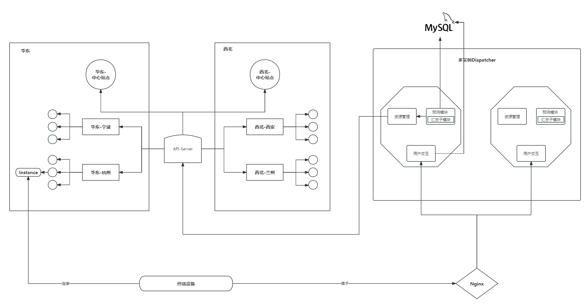

# predict 模块

Predict 模块的功能如下：

1. 定时对该片区下所有边缘站点进行预测，然后汇总结果后进行资源的申请和回收。
2. 调用资源管理模块接口，根据预测结果决定资源的申请或者回收。
3. 管理维护实例状态信息数据库，可以对Running Pod实例池进行增加和删除：
    * 增：在请求资源申请且接收到回调（资源创建成功，返回instance_id等信息）后，需要在数据库中新增实例。
    * 删：在请求删除实例且接收到回调后，需要在数据库中删除实例。

# manager 模块

1. 对外暴露申请资源和回收资源接口，供预测模块调用。
2. 与 Kubernetes 集群交互，进行中心站点资源的申请和回收。

# 整体的 Dispatcher 架构



# 什么是 xxx_test.go 文件？

xxx_test.go 文件通常是 Go 语言中用于编写测试代码的文件。在 Go 语言中，测试代码通常与被测试的代码放在同一个包内，并且测试文件的文件名以 _test.go 结尾，这样测试代码就能够访问被测试代码的私有成员。这种约定是 Go 语言中的一部分，使得编写和运行测试变得非常简单和一致。

在 xxx_test.go 文件中，我们可以编写各种测试函数来测试我们的代码，通常使用 Go 语言内置的测试框架 testing。这些测试函数会检查我们的代码在不同情况下是否按照预期工作，以确保代码的正确性和稳定性。

# go 语言的导出语法?

在 Go 语言中，导出和私有是通过标识符的命名规则来区分的。通常来说，以大写字母开头的标识符是导出的，而以小写字母开头的标识符是私有的。

* **导出的标识符（Exported Identifiers）**：以大写字母开头的标识符可以被外部包（包括我们自己的代码的其他文件）访问和使用。这些标识符被认为是公共的，可以被其他包导入并使用。
* **私有的标识符（Unexported Identifiers）**：以小写字母开头的标识符只能在定义它们的包内部使用。它们对于外部包是不可见的，因此被称为私有的。

以下是一些示例：

```go
package example

// 导出的标识符
const ExportedConstant = 42

// 导出的函数
func ExportedFunction() {}

// 私有的标识符
var unexportedVariable = "private"
```

在上面的例子中，ExportedConstant 和 ExportedFunction 是导出的，因为它们以大写字母开头，可以被其他包使用。而 unexportedVariable 是私有的，只能在 example 包内部使用。


