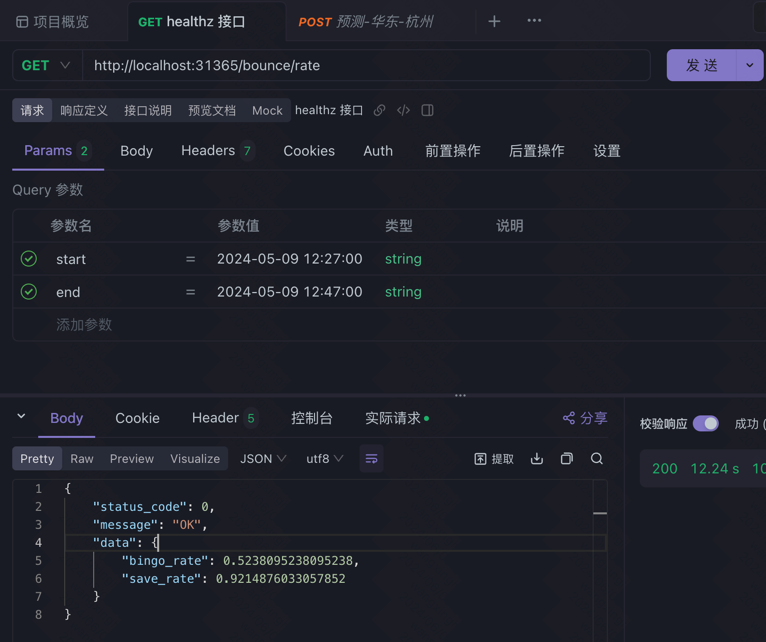

# 测试流程

每次将新功能加入之后，都需要进行测试，以确保新功能的正确性。

shell目录下有reset.sh和start.sh两个脚本文件

reset.sh，用于恢复到原始的测试环境
步骤如下：
1. 停止fakeuser、predict和usercenter模块
2. 重置数据库，包括修改instance_huadong表中实例状态为available、重置record_huadong表、清空bounce_huadong表
3. 调用manager模块的接口，missing设置为0，实现释放K8S集群中所有弹性实例
4. 调用DisconnectAllInstances程序，实现将K8S集群中所有实例断开连接(程序由main.go构建DisconnectAllInstances可执行程序)
5. 停止manager模块

start.sh，用于打包镜像，重启系统
如下步骤：
1. 根据参数判断是否需要重新打包镜像
2. 重启manager、usercenter模块
3. 等待manager模块部署完成
4. 重启predict模块
5. 等待predict模块部署完成，并完成一次预测
6. 部署fakeuser模块

测试 save rate 的接口，请使用 apifox 等工具，因为其会对空格 query 进行转译。

